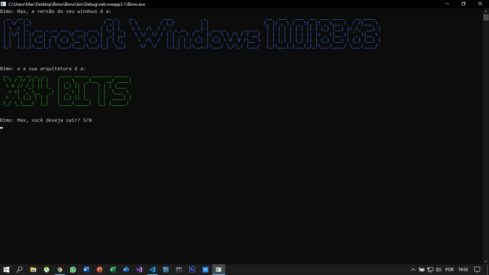

<h2> Este programa demostra qual é a versão do windows e tambem a sua arquitetura!</h2>
<hr>

```
Bimo: Max, a versão do seu windows é a:
  __  __ _                           __ _    __          ___           _                     __  ___   ___  __  ___ ____    __ ____
 |  \/  (_)                         / _| |   \ \        / (_)         | |                   /_ |/ _ \ / _ \/_ |/ _ \___ \  / /|___ \
 | \  / |_  ___ _ __ ___  ___  ___ | |_| |_   \ \  /\  / / _ _ __   __| | _____      _____   | | | | | | | || | (_) |__) |/ /_  __) |
 | |\/| | |/ __| '__/ _ \/ __|/ _ \|  _| __|   \ \/  \/ / | | '_ \ / _` |/ _ \ \ /\ / / __|  | | | | | | | || |> _ <|__ <| '_ \|__ <
 | |  | | | (__| | | (_) \__ \ (_) | | | |_     \  /\  /  | | | | | (_| | (_) \ V  V /\__ \  | | |_| | |_| || | (_) |__) | (_) |__) |
 |_|  |_|_|\___|_|  \___/|___/\___/|_|  \__|     \/  \/   |_|_| |_|\__,_|\___/ \_/\_/ |___/  |_|\___(_)___(_)_|\___/____/ \___/____/


Bimo: e a sua arquitetura é a:
 __   __ __ _  _     ____ _____ _______ _____
 \ \ / // /| || |   |  _ \_   _|__   __/ ____|
  \ V // /_| || |_  | |_) || |    | | | (___
   > <| '_ \__   _| |  _ < | |    | |  \___ \
  / . \ (_) | | |   | |_) || |_   | |  ____) |
 /_/ \_\___/  |_|   |____/_____|  |_| |_____/
```

## _Screenshot_



## _Download_

Baixe o programa e logo em seguida, descompacte na pasta desejada

[Download do arquivo .zip](dist/bimo.zip)

## Creditos

- [Etec Adolpho Berezin](http://eteab.com.br)<br>
Instituição Escolar

- [Ermogenes Palacio](https://github.com/ermogenes)<br> Professor Ermogenes Palacio

- [Diego Neri de Souza Felix](https://github.com/diegoneri)<br> Professor Diego Neri

<hr>

Todos os direitos reservados.<br>
&copy; [MWLeonel 2020](https://github.com/MWLeonel)